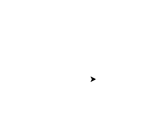

# Computação Gráfica - Triângulo 🔺

<f2 align = "left"> **O seguinte projeto possui o objetivo de construir um triângulo por meio de conhecimentos com fractal.**</f2> 

 

# Importando o módulo Turtle

Para utilizar um módulo no Python, utilizamos o comando import (importar) seguido do nome do módulo que queremos importar. Após a importação, já podemos utilizar todos os objetos e funções que o módulo disponibiliza.
   
  
    import turtle
    

Primeiro, o código cria uma janela gráfica de tartaruga chamada "wn" usando a função Screen() e um objeto de tartaruga chamado "tess" usando a função Turtle():
   
  
    wn = turtle.Screen()
    tess = turtle.Turtle()
  

 Em seguida, o código define uma função chamada "triângulo" que recebe dois argumentos, "x" e "y", que são as coordenadas onde o mouse foi clicado. Dentro da função triângulo, o objeto tartaruga tess é usado para desenhar um triângulo equilátero movendo a caneta tartaruga para cima com a função penup(), movendo para a posição clicada com a função goto(), então movendo a caneta para baixo com a função pendown( ) função. A tartaruga então desenha o triângulo usando um loop for que move a tartaruga 100 pixels para frente e a vira 120 graus para a esquerda três vezes. Finalmente, a tartaruga avança 100 pixels para completar o triângulo: 

    def triangle(x, y):
    tess.penup()

    tess.goto(x, y)

    tess.pendown()
    for i in range(3):
        tess.forward(100)

        tess.left(120)

    tess.forward(100)

 A função turtle.onscreenclick() é usada para vincular a função triângulo ao evento de clique do botão esquerdo do mouse na janela gráfica da tartaruga. Isso significa que sempre que o usuário clicar com o botão esquerdo do mouse na janela, a função triângulo será executada com as coordenadas x e y do clique como seus argumentos.

  
    turtle.onscreenclick(triangle, 1)

 A função turtle.listen() é usada para iniciar o loop de eventos, o que permite que a janela gráfica da tartaruga responda a eventos como cliques do mouse. Finalmente, a função turtle.done() é usada para manter a janela gráfica da tartaruga aberta até que o usuário a feche:

    turtle.listen()
    turtle.done()
